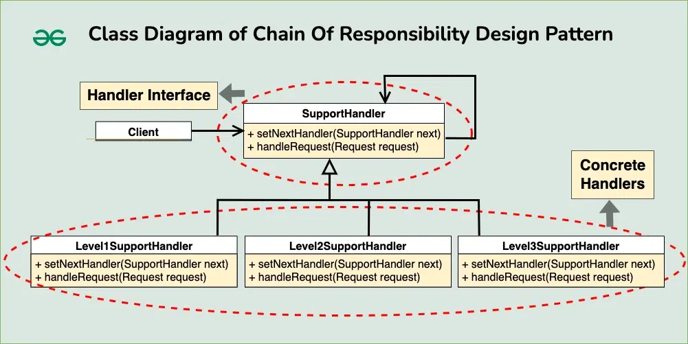

# Chain of Responsibility Design Pattern

## 📌 Overview
The **Chain of Responsibility Design Pattern** is a **behavioral design pattern** that allows a request to be passed along a chain of handlers. Each handler decides either to process the request or to forward it to the next handler in the chain.

This pattern removes the direct dependency between the sender and receiver of a request, promoting **loose coupling** and **flexible request handling**.

---

## 🧠 Key Idea
> *“Don’t ask who will handle the request — just pass it along the chain.”*

Each handler has **one responsibility**:
- Handle the request **OR**
- Pass it to the next handler

---

## ✨ Characteristics

- **Loose Coupling**  
  The sender does not know which object will handle the request.

- **Dynamic Chain**  
  Handlers can be added, removed, or reordered at runtime.

- **Single Responsibility Principle**  
  Each handler focuses on one specific type of request.

- **Sequential Processing**  
  Requests move step-by-step through the chain.

- **Fallback Handling**  
  A default handler can handle unprocessed requests.

---

## 🌍 Real-World Analogy

### 🧑‍💼 Customer Support System
1. **Level 1 Support** – Handles basic issues  
2. **Level 2 Support** – Handles intermediate issues  
3. **Level 3 Support** – Handles complex or critical issues  

If one level cannot resolve the issue, it forwards the request to the next level.

---

## 🧩 Components of the Pattern

### 1️⃣ Handler (Interface / Abstract Class)
- Declares a method to handle requests
- Maintains a reference to the next handler

### 2️⃣ Concrete Handlers
- Implement request-handling logic
- Decide whether to handle or forward the request

### 3️⃣ Client
- Initiates the request
- Sends it to the first handler in the chain

---

## ⚙️ How It Works (Step-by-Step)

1. Define a **Handler interface** with:
   - `setNextHandler()`
   - `handleRequest()`

2. Create **Concrete Handler classes**
   - Each handles a specific case

3. **Link handlers** to form a chain

4. The **client sends a request**
   - The chain processes it sequentially

---

## ✅ Advantages

- Promotes **loose coupling**
- Easy to **extend** and **modify**
- Supports **Open/Closed Principle**
- Clean separation of responsibilities

---

## ❌ Disadvantages

- Request may go **unhandled**
- Debugging can be difficult
- Performance overhead in long chains

---

## 🕒 When to Use

- Multiple handlers can process a request
- Order of handling matters
- You want to avoid tight coupling
- You need flexible request processing

---

## 🚫 When Not to Use

- Only one handler exists
- Performance is extremely critical
- Request handling logic is very simple

---

## 📚 Common Use Cases

- Logging frameworks
- Authentication & authorization pipelines
- Event handling systems
- Middleware architectures
- Customer support systems

---

## 🏁 Conclusion
The **Chain of Responsibility Pattern** is ideal when multiple objects can handle a request and the handler is not known beforehand. It improves flexibility, scalability, and maintainability by decoupling request senders from receivers.

