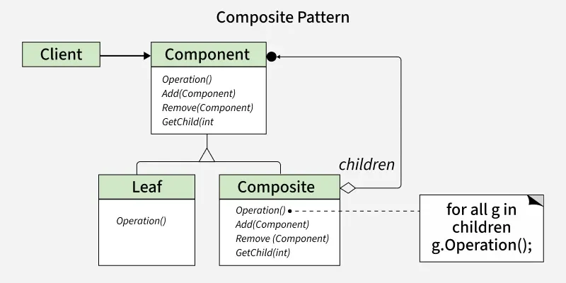

# 🌳 Composite Design Pattern

## 📌 Overview
The **Composite Design Pattern** is a **structural design pattern** that allows you to compose objects into **tree-like structures** to represent **part–whole hierarchies**.  
It enables clients to treat **individual objects (leaves)** and **composite objects (containers)** **uniformly** through a common interface.

---

## 🎯 Intent
- Represent **part–whole hierarchies**
- Treat single objects and groups of objects the same way
- Simplify client code
- Improve flexibility and scalability

---

## 🧠 Key Concept: Part–Whole Hierarchy
A **Part–Whole (Whole–Part) hierarchy** represents complex objects (**wholes**) made up of simpler objects (**parts**).

### Example:
- **Parts:** Files  
- **Wholes:** Directories  
- Both are treated uniformly using the Composite Pattern.

---

## 🌍 Real-Life & Software Examples
- 📂 **File Systems** – Files and folders
- 🎨 **Graphics Applications** – Shapes and groups
- 🏢 **Organization Structures** – Employees and departments
- 🖥️ **GUI Components** – Buttons inside panels

---

## 🧩 Structure of Composite Pattern

1. **Component**
   - Declares a common interface for all objects

2. **Leaf**
   - Represents individual objects
   - No child elements

3. **Composite**
   - Stores child components
   - Implements child-related operations

4. **Client**
   - Interacts with objects using the Component interface

---

## ⚙️ When to Use
✅ When objects form a **tree structure**  
✅ When clients should not differentiate between objects  
✅ When you want easy extensibility  

❌ Avoid if hierarchy is simple or unnecessary

---

## ✅ Advantages
- Uniform treatment of objects
- Simplified client code
- Easy to add or remove components
- Supports complex hierarchical structures
- Improves code reusability

---

## ❌ Disadvantages
- Can be complex to implement
- Deep hierarchies may affect performance
- Hard to restrict component types
- Extra memory usage for storing child references

---

## ⚠️ Potential Pitfalls
- Overengineering simple problems
- Performance overhead in large trees
- Reduced clarity in deeply nested structures

---

## 📁 Example Use Case: File System
A file system where:
- **File** → Leaf
- **Directory** → Composite
- Both share a common interface and can be treated uniformly

---

## 🧠 Key Takeaway
> The Composite Pattern lets you treat **individual objects and compositions of objects uniformly**, making it ideal for hierarchical data structures.

---

## 📚 Design Pattern Type
**Structural Design Pattern**

---

## 🏁 Conclusion
The Composite Design Pattern is best suited for systems that naturally form **tree-like hierarchies** and require **uniform interaction** with both simple and complex objects.

---
