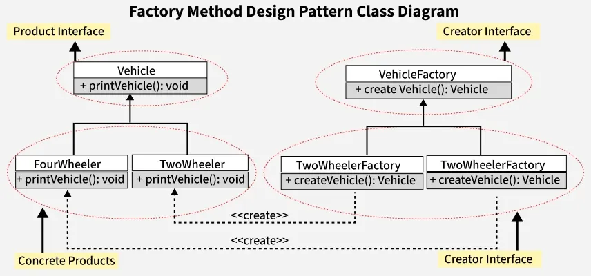

# 🏭 Factory Method Design Pattern

## 📌 Overview
The **Factory Method Design Pattern** is a **creational design pattern** that defines an interface for creating objects but allows subclasses to decide which class to instantiate.

Instead of creating objects directly using constructors, object creation is delegated to a **factory method**, promoting **loose coupling**, **scalability**, and **flexibility**.

---

## 🔑 Key Characteristics
- Subclasses decide which object to create
- Object creation is encapsulated
- Promotes Open–Closed Principle (OCP)
- Client code is independent of concrete classes
- Supports runtime object creation

---

## ⭐ Features of Factory Method Pattern
- **Encapsulation of Object Creation**  
  Clients don’t know how or which objects are created.

- **Loose Coupling**  
  Reduces dependency between client code and concrete implementations.

- **Scalability**  
  New product types can be added without modifying existing client code.

- **Reusability**  
  Common creation logic can be reused across different factories.

- **Flexibility**  
  Supports multiple product families with minimal changes.

- **Testability**  
  Mock factories can be easily used for unit testing.

---

## 🌍 Real-World Use Cases

### 🌐 Web Browsers (Chrome, Firefox)
Factory methods create different page renderers (HTML, PDF, Flash) based on content type.

### 📱 Android OS (Activity Creation)
Android internally uses factory methods to manage activity lifecycle and instantiation.

### 💳 Payment Gateways (Stripe, PayPal)
E-commerce systems use factories to create different payment processors dynamically.

### 🎮 Game Development (Unity, Unreal Engine)
Factories spawn enemies, NPCs, or items based on game level or environment.

---

## 🧩 Components of Factory Method Pattern

### 1️⃣ Product
An abstract interface or class defining common behavior for all products.

### 2️⃣ Concrete Product
Specific implementations of the product interface.

### 3️⃣ Creator (Factory Interface / Abstract Class)
Declares the factory method that returns a product.

### 4️⃣ Concrete Creator (Concrete Factory)
Overrides the factory method to create specific product instances.

---

## 🚗 Example Problem Statement

Consider a software application that needs to handle the creation of different types of vehicles:
- **Two Wheelers**
- **Three Wheelers**
- **Four Wheelers**

Each vehicle type has its own properties and behaviors.  
Using the **Factory Method Pattern**, the client requests a vehicle without knowing its exact class, and the factory decides which vehicle object to create at runtime.

---

## ✅ Advantages
- Eliminates tight coupling
- Improves code maintainability
- Simplifies object creation logic
- Easy to extend with new product types
- Encourages clean architecture

---

## ❌ Disadvantages
- Increases number of classes
- Can add complexity for small systems
- Requires careful design planning

---

## 🕒 When to Use Factory Method
- When object creation logic is complex
- When new object types may be added later
- When following Open–Closed Principle
- When client code should not depend on concrete classes

---

## 🛠️ Real Software Examples
- JDBC (Connection factories)
- Spring Framework (Bean factories)
- Log4j (Logger factories)
- Java Swing & JavaFX UI component factories
- Notification systems (SMS, Email, WhatsApp)

---

## 📌 Summary
The **Factory Method Design Pattern** is ideal for systems that require flexible, extensible, and decoupled object creation.  
It centralizes instantiation logic while allowing easy expansion—making it a cornerstone of scalable software architecture.

---

