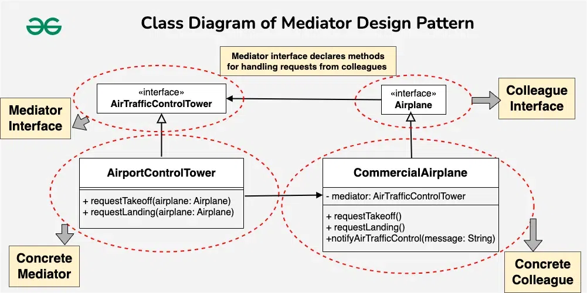

# Mediator Design Pattern

## What
The **Mediator Design Pattern** is a **behavioral design pattern** that centralizes communication between multiple objects by introducing a mediator object.

Instead of objects communicating directly with each other, they communicate **through the mediator**, which reduces tight coupling and improves maintainability.

---

## Purpose
- Simplify communication between multiple objects
- Reduce tight coupling between interacting objects
- Centralize complex interaction logic
- Improve system maintainability and extensibility

---

## Problem Statement
In systems where many objects interact with each other directly, the system becomes:
- Hard to maintain
- Difficult to extend
- Highly coupled
- Error-prone

Example:  
In an **airport**, airplanes need to coordinate takeoff and landing.  
If planes communicate directly, it can lead to chaos and collision risks.

---

## Solution (Mediator Pattern)
The Mediator Pattern introduces:
- A **Mediator** that controls and coordinates communication
- **Colleague objects** that communicate only via the mediator
- Centralized logic for interaction handling

---

## Real-Life Analogy
### Classroom Project
- **Students** → Colleagues  
- **Teacher** → Mediator  

Students communicate through the teacher instead of directly talking to everyone, keeping coordination organized and controlled.

---

## Components of Mediator Design Pattern

### 1. Mediator
- Defines communication methods
- Coordinates interaction between colleagues

### 2. Concrete Mediator
- Implements the mediator interface
- Contains the actual coordination logic

### 3. Colleague
- Communicates only via mediator
- Does not directly reference other colleagues

### 4. Concrete Colleague
- Implements colleague behavior
- Uses mediator to send/receive messages

---

## Example Use Case
### Air Traffic Control System
- Airplanes (Colleagues)
- Control Tower (Mediator)
- Prevents collisions
- Coordinates landing and takeoff

---

## Advantages
- Loose coupling between objects
- Centralized control logic
- Easy to modify interaction behavior
- Improved readability and maintainability

---

## When to Use
- Complex communication among objects
- Need centralized control
- Objects should remain loosely coupled
- Interaction rules change frequently

---

## When Not to Use
- Simple object interactions
- Mediator becomes too complex (God Object)
- Performance-critical systems

