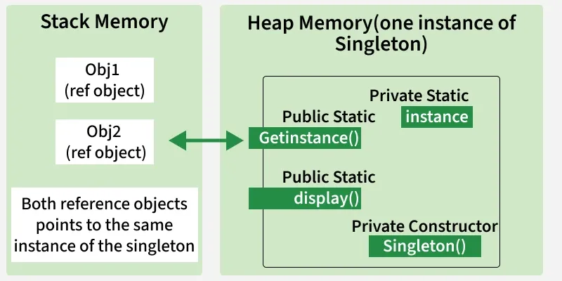

# Singleton Design Pattern

## 📌 Overview
The **Singleton Design Pattern** is a **creational design pattern** that ensures a class has **only one instance** throughout the application and provides a **global access point** to that instance.

It is commonly used when a **single, shared resource** must be managed centrally, such as configuration settings, logging systems, or database connections.

---

## 🎯 Purpose
- Ensure only one instance of a class exists
- Provide controlled global access
- Manage shared resources efficiently
- Prevent inconsistent state caused by multiple instances

---

## 🌍 Real-World Applications

### 🔹 Logging Systems
- Ensures all logs go through a single logger instance  
- Maintains consistency and avoids conflicts

### 🔹 Configuration Managers
- Centralized access to application settings  
- Prevents configuration mismatches

### 🔹 Database Connections
- Manages a single database connection or connection pool  
- Reduces resource overhead

### 🔹 Thread Pools
- Controls and manages concurrent thread execution

### 🔹 Other Examples
- Cache Managers  
- Print Spoolers (single printer queue)  
- Runtime Environments (`java.lang.Runtime`)

---

## ⭐ Features of Singleton Pattern

- **Single Instance**  
  Guarantees only one object exists in the JVM/application

- **Global Access Point**  
  Instance can be accessed from anywhere

- **Lazy or Eager Initialization**  
  - *Eager*: Instance created at class load time  
  - *Lazy*: Instance created when first requested

- **Thread Safety**  
  Can be safely used in multithreaded environments

- **Resource Management**  
  Ideal for managing shared resources

- **Flexible Implementation**  
  Can be implemented using:
  - Eager initialization  
  - Lazy initialization  
  - Double-checked locking  
  - Static inner class  

---

## 🧩 Components

### 1️⃣ Private Constructor
- Prevents external instantiation of the class

### 2️⃣ Static Instance Variable
- Holds the single instance of the class

### 3️⃣ Public Static Access Method
- Returns the single instance

---

## 🔄 How Singleton Works
1. Constructor is made private  
2. A static instance is created (eager or lazy)  
3. A public static method returns the same instance every time  

---

## ✅ Advantages
- Controlled access to a shared resource  
- Saves memory and system resources  
- Consistent behavior across the application  
- Supports centralized configuration and logging  

---

## ❌ Disadvantages
- Global state can lead to hidden dependencies  
- Difficult to unit test (mocking issues)  
- Overuse reduces flexibility and maintainability  
- Can become a bottleneck in highly concurrent systems  

---

## 🕒 When to Use Singleton Pattern
- Only one instance must exist  
- Shared access to resources is required  
- Centralized control is necessary  
- Configuration or logging systems  

---

## 🚫 When NOT to Use
- When multiple instances may be needed  
- When testability is a major concern  
- When it introduces unnecessary global state  
- In highly scalable or distributed systems without careful design  

---

## 📌 Best Practices
- Use thread-safe implementations  
- Avoid excessive logic inside Singleton  
- Prefer dependency injection where possible  
- Use Singleton **judiciously**, not by default  

---

## 🧠 Key Takeaway
> **The Singleton Pattern provides a clean solution for managing shared resources, but should be used carefully to avoid tight coupling and testing challenges.**
